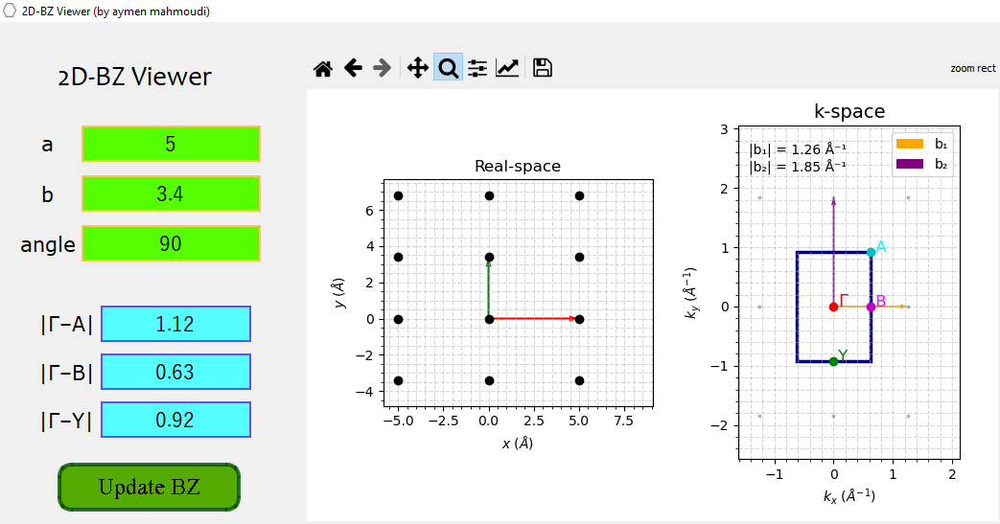

# 2D-BZ-Viewer

## Description

This project helps visualize the Brillouin zone for 2D lattices as well as their real-space representation.  
In crystallography, Bravais lattices describe the fundamental periodic arrangements of points in space. In **two dimensions (2D)**, there are **five** distinct Bravais lattice types: *oblique*, *rectangular*, *centered rectangular*, *square*, and *hexagonal*.

### 2D Bravais Lattice Types

| # | Lattice Type         | Parameters                                 |
|---|---------------------|--------------------------------------------|
| 1 | Oblique             | \( a \ne b, \gamma \ne 90^\circ \)         |
| 2 | Rectangular         | \( a \ne b, \gamma = 90^\circ \)           |
| 3 | Centered Rectangular| \( a \ne b, \gamma = 90^\circ \)           |
| 4 | Square              | \( a = b, \gamma = 90^\circ \)             |
| 5 | Hexagonal           | \( a = b, \gamma = 120^\circ \)            |

---

## Project Structure

```
2D-BZ-Viewer/
├── README.md
├── requirements.txt
├── screenshot_app.png
└── src/
    ├── main.py
    ├── gui.py
    └── gui.ui
```

- **README.md**: Project documentation and instructions.
- **requirements.txt**: Python dependencies.
- **screenshot_app.png**: Example screenshot of the GUI.
- **src/**: Source code folder.
  - **main.py**: Main application logic and GUI integration.
  - **gui.py**: Python code generated from the Qt Designer `.ui` file.
  - **gui.ui**: Qt Designer file describing the GUI layout.

---

## Usage

1. Enter the lattice parameter values (`a`, `b`, and the angle between them).
2. Click the **Update BZ** button to visualize the lattice and Brillouin zone.



---

## Installation

1. Clone or download this repository.
2. Install the required libraries using:

   ```console
   pip install -r requirements.txt
   ```

3. Run the `main.py` script from the `src` folder:

   ```console
   python src/main.py
   ```

> **Note:** The GUI is tested with Python 3.8. It is recommended to use a Python 3.8 virtual environment.

---

## Roadmap

- [ ] Prevent app crashes when values are empty
- [ ] Transform the project into a desktop application

---

## Support and Contributing


Special thanks to Geoffroy Kremer for testing and verifying## Acknowledgment---If you encounter any issues, please open an issue on GitHub. For confidential matters, feel free to email me directly.Suggestions and ideas for enhancing the scripts or adding features are warmly appreciated!  Suggestions and ideas for enhancing the scripts or adding features are warmly appreciated!  
If you encounter any issues, please open an issue on GitHub. For confidential matters, feel free to email me directly.

---

## Acknowledgment

Special thanks to Geoffroy Kremer for testing and verifying the formula.


